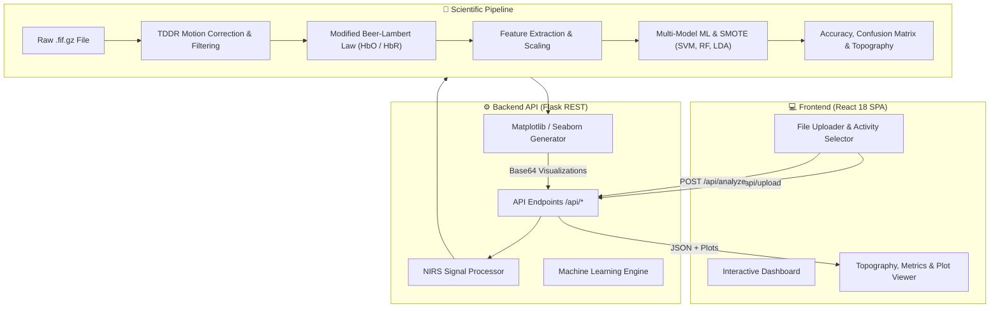

<div align="center">

# 🧠 NIRS Web App
### End-to-End fNIRS Neuroimaging & BCI Machine Learning Platform

[](https://www.python.org/)
[](https://flask.palletsprojects.com/)
[](https://reactjs.org/)
[](https://mne.tools/)
[](https://scikit-learn.org/)
[](LICENSE)

<p align="center">
  <b>An interactive full-stack platform for decoding cognitive and motor states from Functional Near-Infrared Spectroscopy (fNIRS) optical signals using advanced neuro-signal processing and machine learning.</b>
</p>

[Key Features](#-key-features) • [Architecture](#-system-architecture) • [Quick Start](#-quick-start) • [Sample Data](#-sample-data--demo) • [Project Structure](#-project-structure) • [Author](#-author)

</div>

---

## 📖 Overview

**Functional Near-Infrared Spectroscopy (fNIRS)** is a non-invasive optical neuroimaging technique that measures cortical hemodynamic responses by projecting near-infrared light through the scalp and skull to detect concentration changes in oxygenated ($\Delta[\text{HbO}]$) and deoxygenated ($\Delta[\text{HbR}]$) hemoglobin.

The **NIRS Web App** streamlines the analysis and classification of multi-channel fNIRS recordings. It bridges biomedical signal processing with modern machine learning and an intuitive web interface, allowing researchers, clinicians, and neurotechnology enthusiasts to upload raw `.fif` / `.fif.gz` datasets, isolate experimental conditions (e.g. *Motor Execution*, *Finger Sequencing*, *Rest*), train multi-model classifiers, and interpret results in real-time.

---

## ✨ Key Features

### 🔬 1. Biomedical Signal Processing Pipeline
- **Motion Artifact Correction**: Integrates Temporal Derivative Distribution Repair (**TDDR**) to suppress baseline shifts and spike artifacts caused by head movements.
- **Digital Filtering**: Zero-phase bandpass filtering ($0.01\text{ Hz} - 0.5\text{ Hz}$) to eliminate cardiac pulsations, respiratory cycles, Mayer waves, and low-frequency instrumentation drifts.
- **Modified Beer-Lambert Law (MBLL)**: Optical density conversion into physiological hemodynamic concentration trajectories ($\text{HbO}$ and $\text{HbR}$).

### 🤖 2. Machine Learning & BCI Classification Engine
- **Multi-Model Benchmark**: Evaluates and compares multiple classifiers simultaneously:
  - Support Vector Machines (**SVM** with RBF and Linear kernels)
  - **Random Forest** & **Gradient Boosting** Ensembles
  - Linear Discriminant Analysis (**LDA**)
  - Gaussian Naive Bayes (**GNB**)
- **Data Balancing & Robust Validation**:
  - Synthetic Minority Over-sampling Technique (**SMOTE**) for unbalanced experimental trials.
  - Stratified $K$-Fold Cross-Validation and Leave-One-Out CV for small sample regimes.
- **Feature Engineering**: Time-domain statistical moments, peak amplitudes, slope rates, wavelet coefficients, and signal power spectrum.

### 🗺️ 3. Neurotopographic & Connectivity Visualizations
- **Brain Region Topography**: Automatically maps optical sensor montages to anatomical cortices (*Prefrontal, Premotor, Primary Motor, and Parietal*), scoring regional importance.
- **Inter-Channel Functional Connectivity**: Computes correlation matrices and generates heatmaps reflecting synchronized cortical activity.
- **Power Spectral Density (PSD)**: Frequency-domain characterization of hemodynamic variations across channels.

### ⏱️ 4. Temporal Bias & Data Leakage Validation
- Dedicated validation module dividing trial sequences chronologically to detect temporal autocorrelation or drift biases, ensuring that machine learning models generalize to future unobserved intervals rather than memorizing time-series trends.

---

## 🏗️ System Architecture



---

## 🚀 Quick Start

Follow these simple steps to run both backend and frontend on your local machine.

### Prerequisites
- **Python 3.9+** (Python 3.11 recommended)
- **Node.js 16+** and **npm**

---

### 1️⃣ Backend Setup (Flask API)

```bash
# 1. Clone repository
git clone https://github.com/AsierMSA/nirs_web_app.git
cd nirs_web_app/nirs-analysis-backend

# 2. Create and activate virtual environment
# Windows:
python -m venv venv
.\venv\Scripts\Activate.ps1

# macOS / Linux:
python3 -m venv venv
source venv/bin/activate

# 3. Install dependencies
pip install -r requirements.txt

# 4. Start the backend server
python run.py
```
> 📡 **Backend runs on:** `http://localhost:5000`

---

### 2️⃣ Frontend Setup (React SPA)

Open a new terminal window:

```bash
# Navigate to frontend directory
cd nirs_web_app/frontend

# Install dependencies
npm install

# Start development server
npm start
```
> 🌐 **Frontend will automatically launch at:** `http://localhost:3000`

---

## 📂 Project Structure

```plaintext
nirs_web_app/
├── sample_data/                     # 📂 Ready-to-use sample fNIRS datasets for demo
│   ├── sample_nirs_data.fif.gz      # Preprocessed TDDR fNIRS recording
│   └── README.md                    # Sample dataset documentation & channel montage
│
├── notebooks/                       # 📓 Jupyter notebooks for offline processing
│   ├── NIRS_TO_FIF_GZ.ipynb         # Raw NIRS to MNE .fif.gz conversion pipeline
│   └── README.md                    # Data preprocessing guide
│
├── frontend/                        # 💻 React Web Application
│   ├── public/                      # Static assets & HTML template
│   ├── src/
│   │   ├── api/apiService.js        # API client for backend communication
│   │   ├── components/              # UI components (Uploader, Selectors, Viewers)
│   │   ├── styles/                  # CSS stylesheets
│   │   ├── App.js                   # Main application state controller
│   │   └── index.js                 # React DOM mount point
│   ├── package.json                 # Frontend dependencies and scripts
│   └── README.md                    # Frontend documentation
│
├── nirs-analysis-backend/           # 🧠 Flask REST API & Scientific Core
│   ├── app/
│   │   ├── api/routes.py            # API routes (/upload, /analyze, /files, etc.)
│   │   ├── core/nirs_processor.py   # Signal filtering, TDDR, connectivity, PSD
│   │   ├── core/nirs_ml.py          # Machine learning classification & CV
│   │   ├── utils/                   # JSON formatters & file managers
│   │   ├── config.py                # Environment configuration
│   │   └── __init__.py              # Flask app factory & CORS setup
│   ├── tests/                       # 🧪 Automated test suite (pytest)
│   │   ├── test_api.py              # API endpoint integration tests
│   │   └── test_analyzer.py         # Processing & utility tests
│   ├── uploads/                     # Runtime storage for uploaded files
│   ├── requirements.txt             # Python backend dependencies
│   ├── run.py                       # Server entry point
│   └── README.md                    # Backend documentation
│
├── .gitignore                       # Clean repository ignore rules
├── LICENSE                          # MIT License
└── README.md                        # Project landing & overview documentation
```

---

## 🧪 Sample Data & Demo

Want to try the web app right away?
We have provided a preprocessed dataset inside [`sample_data/`](sample_data/):

- **Dataset**: `sample_nirs_data.fif.gz`
- **Recorded Tasks**: `Finger Sequencing` vs `Simple Tapping` vs `Rest`
- **How to test**:
  1. Open the web interface at `http://localhost:3000`.
  2. Upload `sample_data/sample_nirs_data.fif.gz` or pick it from the available files list.
  3. Check the activities to compare.
  4. Click **"Analyze Data"** to view real-time accuracy scores, confusion matrices, and brain topographic importance.

---

## 🔬 Automated Testing

Run the backend test suite with `pytest`:

```bash
cd nirs-analysis-backend
pytest
```

---

## 👨‍💻 Author

**Asier Martínez Santisteban**
- 💼 **GitHub**: [@AsierMSA](https://github.com/AsierMSA)
- 🌐 **Portfolio**: [AsierMSA Portfolio](https://github.com/AsierMSA)
- 🧠 *Focus Areas*: Biomedical Engineering • Neurotechnology • Brain-Computer Interfaces (BCI) • Machine Learning • Full-Stack Development

---

## 📄 License

This project is licensed under the MIT License - see the [LICENSE](LICENSE) file for details.
